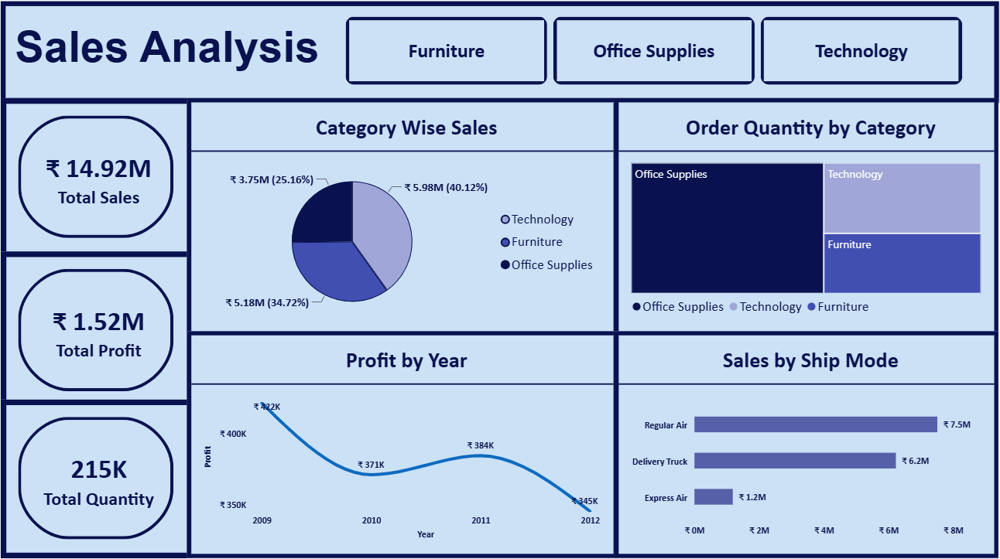

# 📊 Sales Data Analysis DASHBOARD - POWER BI

## 📌 Objective

Analyze sales performance across categories, products, and shipping modes using Power BI.

---

## 🛠️ Tools Used

* Microsoft POWER BI

---

## Data Cleaning

* Corrected data type
* Removed duplicate items
* Verified data quality by checking missing values, errors, and value distributions

---

## KPIs
* Total Sales: 14.92M
* Total Profit: 1.52M
* Total Quantity: 215K

---

## Visualizations
* Category-wise Sales
* Profit by Year
* Order Quantity by Category
* Sales by ship Mode

---

## 📁 Files

* Sales_analysis_dashboard.pbix
* sales_data.csv
* screenshots/

---

## 📸 Dashboard Preview

---

## 📈 Key Insights

* Technology generated the highest sales: ₹5.98M (40.12%).
* Regular Air had the highest sales: ₹7.5M.
* Profit was highest in 2009 (₹422K) and lowest in 2012 (₹345K).
* Overall profit margin was 10.2%

---

## 🎯 Conclusion

This project demonstrates the use of POWER BI for data analysis, data aggregation, business insight generation, and reporting. The analysis helps identify sales performance trends, profitable categories, and loss-making products that can support data-driven business decisions.

